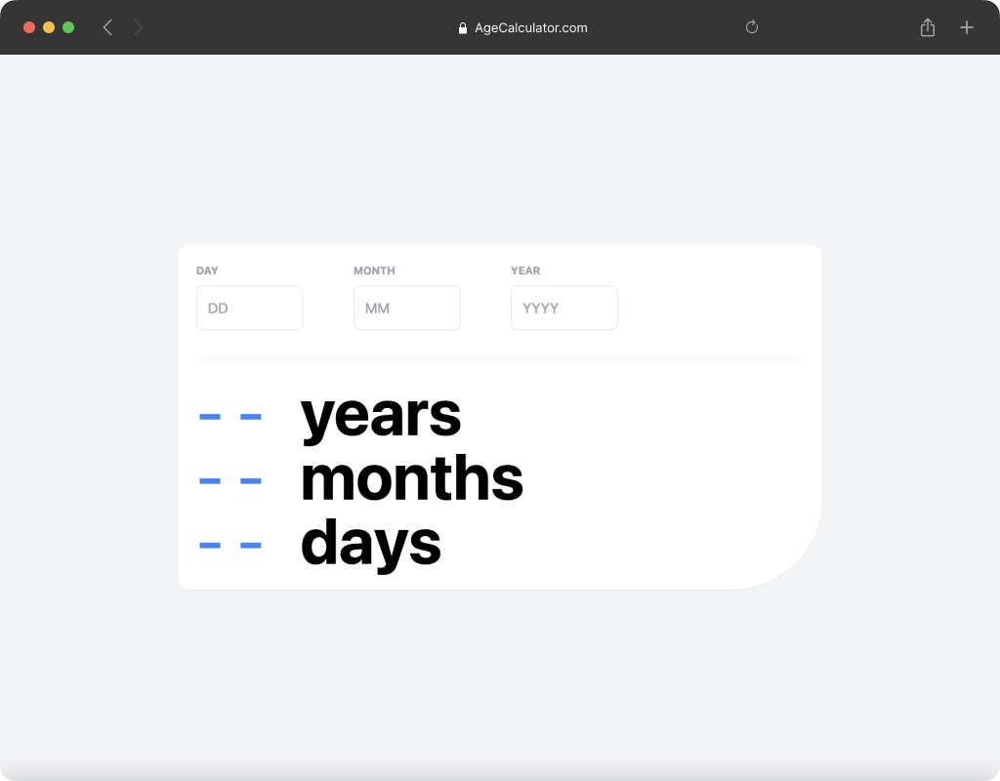
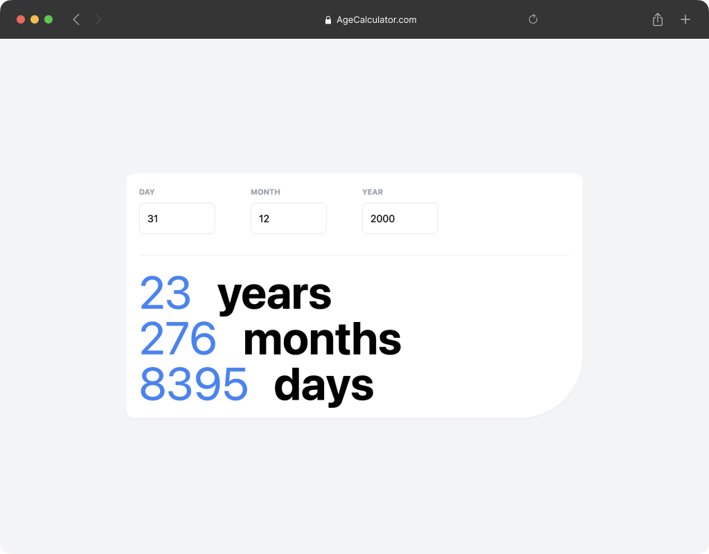
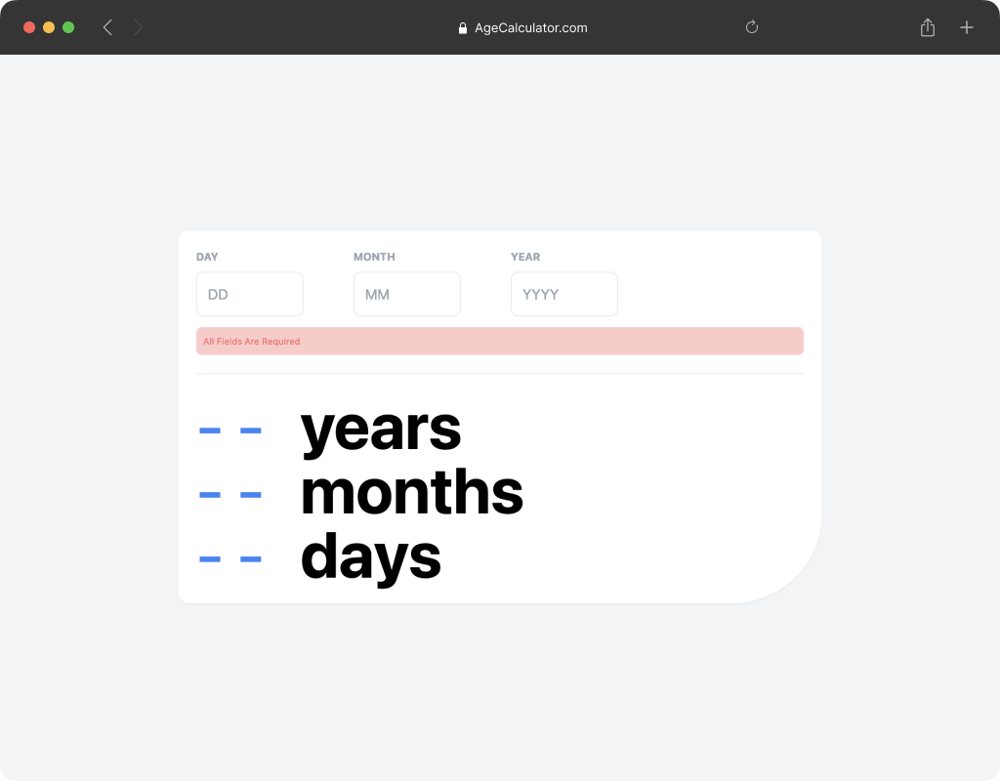
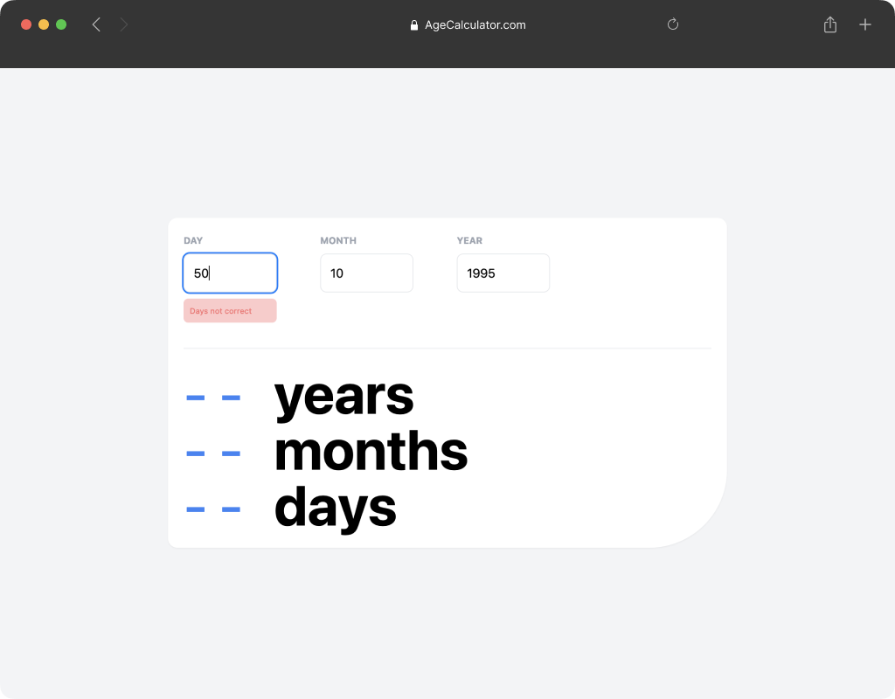

# Age Calculator

Age Calculator will help you to know what's is the age of an individual, the months that individual has been in the world and also the days, this is a simple project that calculate a birthday and show your age, months and days. The project also show you error messages when you field invalid data.

#### 🚀 [Deployment](https://gorgeous-griffin-a813a7.netlify.app/)

## 🛠 Technologies

- HTML
- Tailwind
- JavaScript

## 📸 Screen Shots

## Author

- [@Johanh0](https://www.github.com/johanh0)

## Support or contact

For support or if you wish contact me please, email me to [johanherrera20000@gmail.com](mailto:johanherrera20000@gmail.com).
